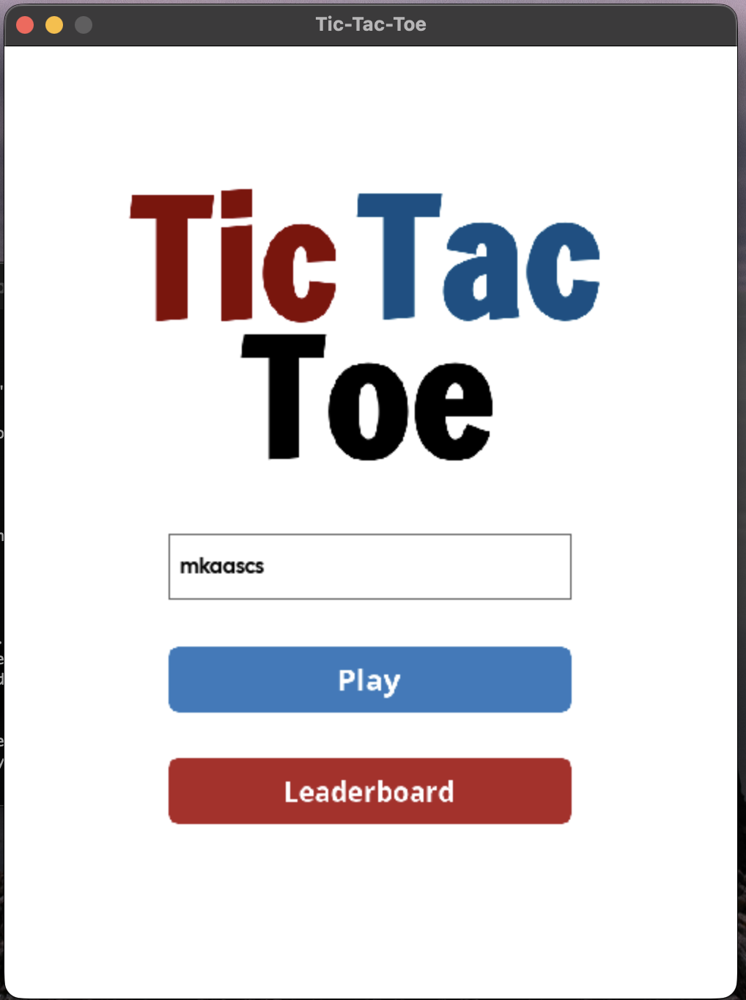
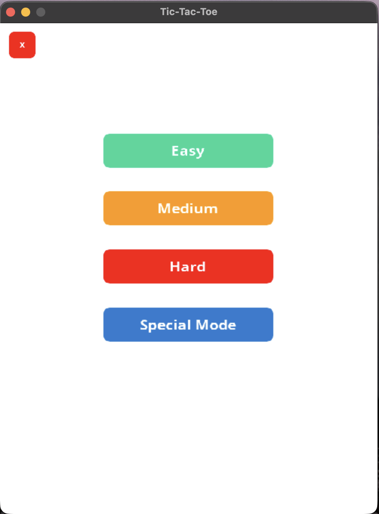
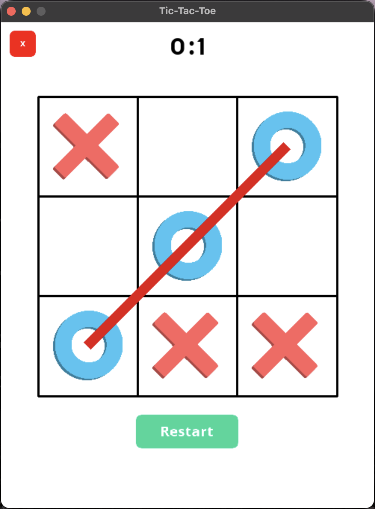
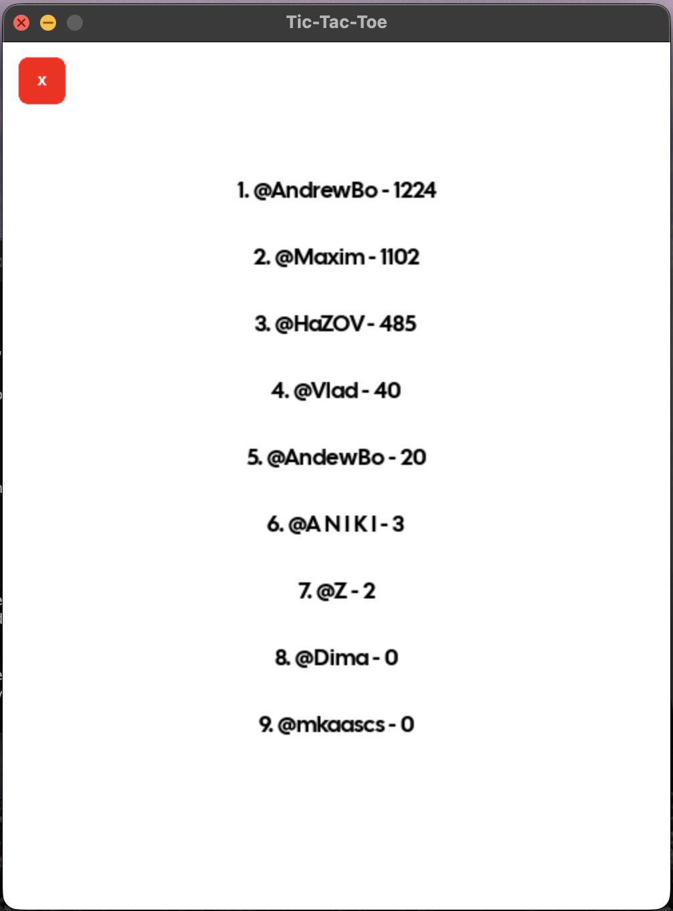

# Tic-Tac-Toe (cross & ball)

A first-year course project — a **Tic-Tac-Toe** game written in **C** with a graphical interface built on **SDL2**.

The player (crosses) plays against a bot (balls). It features difficulty selection, a special mode, a leaderboard, and score tracking.

## Screens

### Main menu
Enter the player name, then use the "Play" and "Leaderboard" buttons.



### Difficulty selection
Four modes: **Easy**, **Medium**, **Hard**, and **Special Mode**.



### Game board
A 3×3 board with the score on top, a "Restart" button, and a close button to return to mode selection. The winning line is highlighted on victory.



### Leaderboard
A list of players with their scores, sorted in descending order.



## Difficulty modes

| Mode | Bot behavior |
|------|--------------|
| **Easy** | Half random moves, half attempts to win/block |
| **Medium** | Always completes its own line, blocks the player, prefers the center and corners |
| **Hard** | Center → fork → block fork → corners strategy; rarely makes mistakes |
| **Special Mode** | Medium rules, but each player keeps at most **3 marks** on the board — on the 4th move the oldest mark disappears |

## Scoring

Points for a win depend on difficulty: `factor × number of wins`, where `factor = 20 × (level − Easy)` (Easy uses 1). The result is written to the leaderboard when leaving the game screen, provided a name was entered.

## Architecture

The project is organized in layers (MVC-like):

```
game/
  domain/        # game logic: entities (game, leaderboard), move queries (moves)
  controllers/   # screen state handlers (menu, mode, board, leaderboard)
  views/         # rendering (layout, primitives, sprites, screens)
  ai/            # bot and difficulty levels
  session/       # current player session (name)
memstat/         # tracker for malloc/calloc/realloc/free calls
main.c           # entry point, game loop, and screen switching
```

- The **leaderboard** is stored as an **AVL tree** (`leaderboard.c`) for fast sorted insertion.
- **memstat** wraps allocations and, on exit, writes statistics to `memstat.txt`.
- Data is persisted in `leaderboard.txt` (players and scores) and `memstat.txt` (memory stats).

## Dependencies

- **SDL2**, **SDL2_ttf**, **SDL2_gfx** (installed via Homebrew)
- CMake ≥ 3.10, a C11-capable compiler

```sh
brew install sdl2 sdl2_ttf sdl2_gfx
```

## Build & run

```sh
cmake -B build
cmake --build build
./build/cross_ball
```

> The SDL2 library paths in `CMakeLists.txt` are set for Homebrew on Apple Silicon (`/opt/homebrew`). On another system, adjust `SDL2_PATH`, `SDL2_GFX_PATH`, and `SDL2_TTF_PATH`.

Run it from the project root — the game reads sprites, fonts, and data files via relative paths (`assets/`, `leaderboard.txt`, `memstat.txt`).

## Controls

- **Left click** on a cell — make a move
- **Restart** — start a new round (score is kept)
- **✕** (top-left) — return to mode selection
